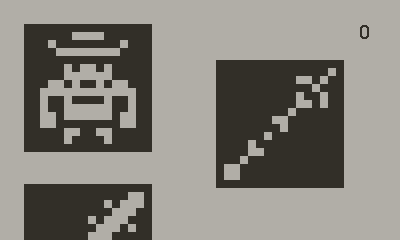
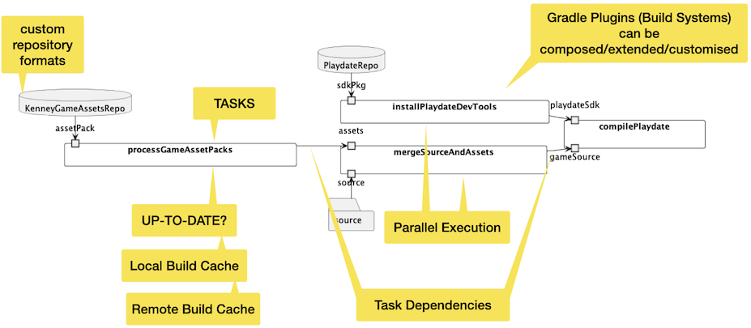

# Custom Gradle-based Build System

This is an example of how to create a custom build system based on [Gradle](https://github.com/gradle/gradle).
It only uses the Gradle core without any existing plugins.

## The Build System

The build system is implemented as a Gradle Plugin.
It can be used to develop Games for the [playdate handheld game system](https://play.date/) that are based on existing 1-bit picture assets from [Kenney](https://www.kenney.nl/).
This repository contains a [simple picture matching game](source/main.lua) where you have to find a picture in a list using the Crank to scroll through the list.
The build system itself could be used to develop other picture-based games using Kenney's assets.

That's why the build system (the Gradle plugin) is called **playdate-picture-game**.
It automates the following tasks:

- Selecting a Playdate version that is downloaded and installed (only works on Mac right now)
- Selecting an asset pack from Kenney's website that is downloaded and processed to match the playdate's _image table_ format
- Combining your sources and the image so that they fit the playdate project structure and then calling the playdate compiler

## Advantage of using Gradle

By doing this setup in Gradle, you automatically get:

- Downloading and caching of dependencies (SDK, assets)
- Incremental building (only tasks for which things change are executed)
- Local Build Cache
- Remote Build Cache
- Parallel execution
- Build Scans to analyse the build

## Usage

- Build everything with `./gradlew :compilePlaydate` (see [limitations](#limitations-of-this-example) below if you get an error)
- You can add `--console=plain` and/or `--scan` to see what's happening in the build
- Run the build multiple times to see incremental building and caching in action
- Adjust the dependencies - asset pack, SDK version - in  [build.gradle.kts](build.gradle.kts)
- Adjust the game source in [source/main.lua](source/main.lua)
- Run the game in the playdate simulator (free to use, part of SDK) by starting  
  `build/dist/playdate-sprite-match.pdx`
- Explore the _Build System Implementation_ (Gradle Plugin Implementation) in [gradle/playdate-picture-game/src/main/kotlin](gradle/playdate-picture-game/src/main/kotlin)
  (Check [my Understanding Gradle videos](https://www.youtube.com/c/onepieceSoftware) for information on the Gradle concepts used)

## Limitations of this example

The `installPlaydateSdk` task currently **only work on Mac (OS X)** and **needs to use `sudo`** to call the `installer` tool.
It only works if you run as administrator account with the allowance to run `sudo` without typing your password again.
You can configure that using `visudo`. If you don't want to or can't do that you can still see the example in action if you remove the _sudo installer_ call from [PlaydateSdkInstall.kt](gradle/playdate-picture-game/src/main/kotlin/software/onepiece/playdate/gradle/tasks/PlaydateSdkInstall.kt#L26) and install the SDK manually.
The rest of the example still works.

